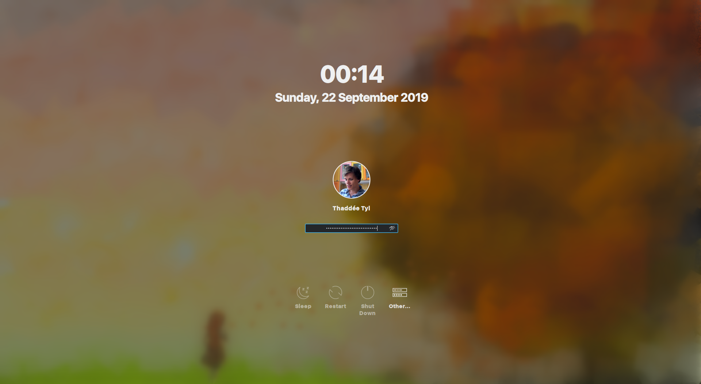

# Simpler Breeze

*A cleaner KDE login theme page*.

## Improvements

- Omit the needless login button.
- Center the username and password field text.
- Use smaller dots for the password character. The default did not even fit the text field.
- Upgrade the input widgets to Plasma Components 3.0.
- Use the Autumn wallpaper.
